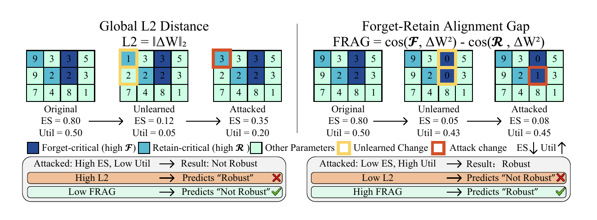
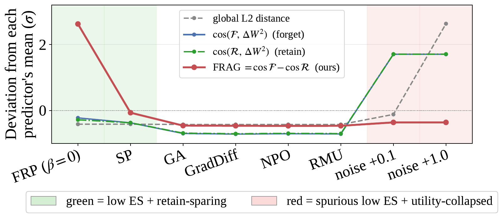

# FRAG: Forget–Retain Alignment Gap

Code for **"Distance Is Not Enough: Forget-Retain Alignment Gap Predicts LLM
Relearning Robustness"** (EMNLP 2026, Main Conference).

## Distance is not enough

Unlearned LLMs often fail to stay unlearned: a short round of fine-tuning can
revive knowledge that was supposedly removed. Existing predictors of this
failure ask how *far* the weights moved from the original model — a global
$\ell_2$ displacement. But distance alone is misleading, because a random or
destructive update can travel very far while unlearning nothing.

What matters is *which* weights moved. A robust update should land on
**forget-critical** weights — those active on the forget data but not the retain
data — while sparing the **retain-critical** ones the model still needs.



Large $\ell_2$ can falsely suggest robustness when the edit hits retain-critical
weights, and small $\ell_2$ can miss a genuinely robust forget-critical edit.
FRAG captures both cases.

## FRAG and FRP

**FRAG** is a training-free predictor of relearning robustness. It scores
whether an unlearning update aligns with forget-critical weights while avoiding
retain-critical ones, using only calibration forward passes and a weight
comparison — no relearning attack is ever run. On a single A6000 it takes ~25 s
at 1B and ~4 min at 14B, against 30 min to over an hour for one attack
checkpoint.

**FRP** applies the same principle by construction: it prunes weights that are
forget-important, retain-unimportant, and large enough to matter, improving
relearning robustness at a controllable cost in retain-side utility.

## Results

### Robustness on TOFU (LLaMA-3.2-1B)

Averaged over the retain, forget, and forget+retain relearning attacks. ES is
extraction strength (lower is better), U is retain-side utility, ΔES is the
recovery caused by the attack.

| Method | ES ↓ | U ↑ | Attacked ES ↓ | ΔES ↓ | Attacked U ↑ | $\ell_2$ | FRAG (%) |
|---|---|---|---|---|---|---|---|
| Retain (gold) | 0.064 | 0.596 | 0.072 | 0.008 | 0.591 | – | – |
| GA | 0.086 | 0.199 | 0.279 | 0.193 | 0.518 | 0.9 | 0.002 |
| GradDiff | 0.123 | 0.498 | 0.320 | 0.198 | 0.598 | 0.6 | 0.003 |
| NPO | 0.126 | 0.487 | 0.248 | 0.122 | 0.583 | 0.7 | 0.000 |
| RMU | 0.105 | 0.561 | 0.525 | 0.420 | 0.594 | 0.8 | 0.004 |
| SP | 0.124 | 0.486 | 0.203 | 0.079 | 0.513 | 120.6 | 0.393 |
| **FRP** (β=0.00) | **0.055** | 0.384 | **0.085** | **0.029** | 0.444 | 107.8 | **3.159** |
| **FRP** (β=0.15) | 0.099 | 0.494 | 0.157 | 0.058 | 0.517 | 81.4 | 3.020 |

The failure of distance is visible in one comparison: SP has the **larger**
$\ell_2$ (120.6 vs 107.8) yet recovers **2.7× more** under attack (ΔES 0.079 vs
0.029). FRAG ranks them the other way round, correctly. The same ordering holds
on LLaMA-3.2-3B.

### FRAG predicts robustness better than distance

Spearman ρ against ΔES over healthy checkpoints (5 methods × 3 splits × 2
models). More negative is better; "w/o FRP" drops every FRP checkpoint to rule
out circularity.

| Predictor | 1B | 1B w/o FRP | 3B | 3B w/o FRP | Pooled | Pooled w/o FRP |
|---|---|---|---|---|---|---|
| Global $\ell_2$ | −0.56 | −0.36 | −0.17 | **+0.13** | −0.36 | −0.10 |
| **FRAG** | **−0.92** | **−0.85** | **−0.72** | **−0.71** | **−0.78** | **−0.74** |

At 3B, $\ell_2$ loses the correct sign entirely. Averaged over eight effective
relearning-attack variants (learning rate, optimizer, attack-data mixture,
fine-tuning horizon), the gap is −0.94 for FRAG against −0.38 for $\ell_2$.

### Why distance can be spoofed



Curves are normalized per predictor. Global $\ell_2$ and the individual cosine
terms peak on **utility-collapsed** perturbations — models that moved far but
unlearned nothing — while FRAG peaks on the low-ES, retain-sparing FRP
checkpoint.

### The gain is not a confound

FRP's advantage survives four matched controls, each holding one confound fixed:

| Control | Result |
|---|---|
| Matched utility | 1.9–4.9× lower ΔES than RMU in every band |
| Matched forgetting strength | Closest to the gold ES floor, lowest ΔES |
| Matched sparsity | 3–4× lower pre-attack ES than SP at equal budget |
| Matched update norm | 2.2–2.9× lower ΔES than SP at equal $\lVert\Delta W\rVert_2$ |

## Status

Code release is in preparation. This repository currently holds only this
README; the implementation, configs, and scripts to reproduce the TOFU and
WMDP-cyber results will be added here.

## Paper

- arXiv: *to be added*
- ACL Anthology: *to be added*

## Citation

```bibtex
@inproceedings{chen2026frag,
  title     = {Distance Is Not Enough: Forget-Retain Alignment Gap Predicts
               LLM Relearning Robustness},
  author    = {Chen, Yi and Hsieh, Hanna and Liu, Shuhong and Hua, Chuanbo and
               Ma, Zihan and Wang, Kun and Kim, Joo-Young},
  booktitle = {Proceedings of the 2026 Conference on Empirical Methods in
               Natural Language Processing (EMNLP)},
  year      = {2026}
}
```
